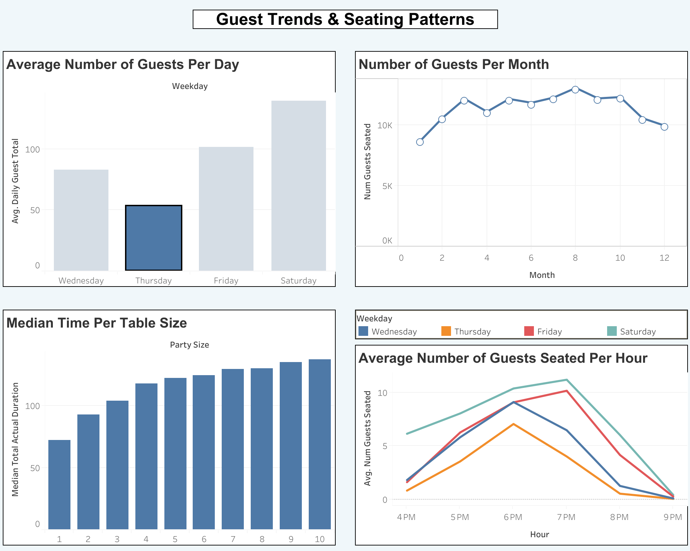
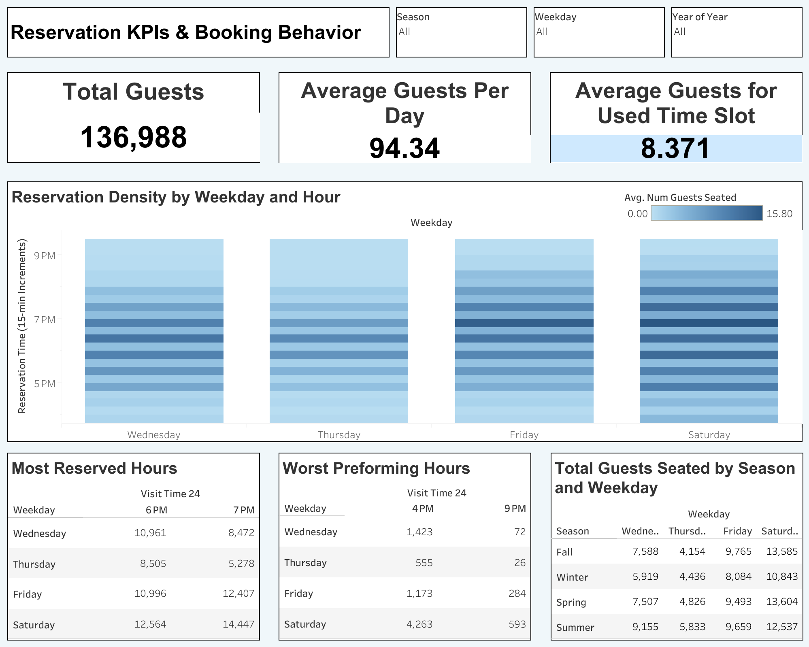

# Jules@Market Reservation Trends Analysis

This project analyzes reservation patterns for Jules@Market using OpenTable data, with the goal of identifying underutilized times and improving restaurant efficiency.

##  Objectives
- Identify slow reservation periods by day and season
- Analyze patterns to help recommend adjustments to staffing or promotions

## Tools Used
- Python (Pandas, NumPy)
- Tableau
- Jupyter Notebook

## Dashboards

1. **Guest Trends and Seating Patterns**  
   [View on Tableau Public](https://public.tableau.com/views/GuestTrends/GuestTrendsSeatingPatterns?:language=en-US&:sid=&:redirect=auth&:display_count=n&:origin=viz_share_link)  
   

2. **Reservation KPIs and Booking Behavior**  
   [View on Tableau Public](https://public.tableau.com/views/ReservationTrends/ReservationKPIsBookingBehavior?:language=en-US&:sid=&:redirect=auth&:display_count=n&:origin=viz_share_link)  
   

## Jupyter Notebook

The full analysis, including data cleaning, aggregation, and visualization, is in `reservation_analysis.ipynb`.
